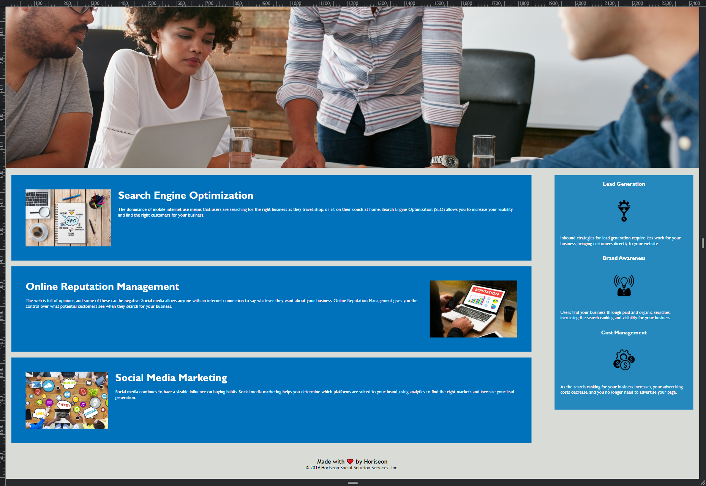

# Code Refactor - About Us
Github link: https://github.com/DanTheDev-zsh/my-mock-portfolio

## Short Discription   
___
This is a stock website offered by UW Programming Bootcamp to demonstrate **code refectoring**
1. html originally had non-semantically correct HTML elements
2. html originally had wrong styling and position on its elements
3. html originally had no alt attributes in the img element

## Screenshots
___
* First screenshot

* Second screenshot

